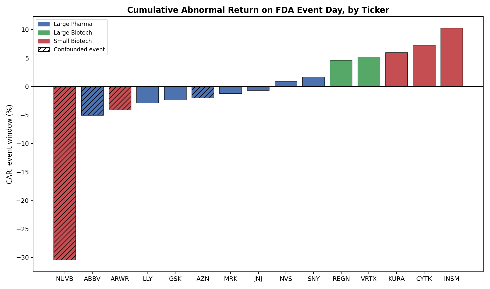
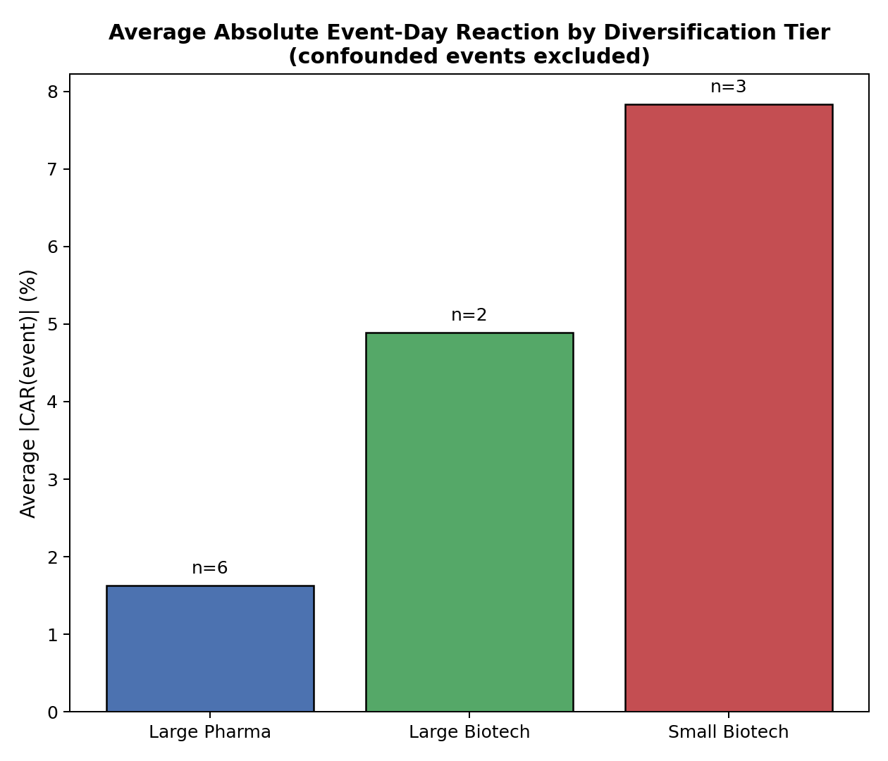

# FDA Event Study: Abnormal Stock Returns Around Drug Approvals

[](https://www.python.org/)
[](#findings)
[](#findings)

**Author:** Jae-Yi Lee
**Institution:** Imperial College London — MSci Chemistry with Medicinal Chemistry
**Project Type:** Independent pharma equity research portfolio project

---

**Small biotechs react roughly 5x harder to an FDA approval than large diversified pharma does.**
Across 15 self-sourced events, average absolute event-day abnormal return scales
monotonically with how much of a company's value rests on a single asset — 1.6% for
large pharma, up to 7.8% for small-cap biotech.

| Tier | Avg \|CAR(event)\| | n |
|:--|--:|--:|
| Large Pharma | 1.6% | 6 |
| Large Biotech | 4.9% | 2 |
| **Small Biotech** | **7.8%** | 3 |

---

## Overview

This project measures how pharmaceutical and biotechnology stocks react to FDA drug
approval announcements, using event-study methodology to isolate the company-specific
"surprise" in a stock's return from broader market movement. It tests a simple
hypothesis: does the size of a company's reaction to an approval scale with how
diversified its business is?

All data is self-sourced via `yfinance` — no pre-made datasets. The full pipeline
(fetch, slice, regress, compute abnormal returns) is a single reusable function,
`run_event_study(ticker, event_date)`, applied identically across 15 companies.

---

## Background

A single FDA approval means very different things depending on the company. For a
large, diversified pharmaceutical company with dozens of marketed products, one new
approval is a rounding error on total revenue. For a small, single-asset biotech, the
same category of news can represent the entire value of the company. This project
tests whether that intuition actually shows up in measured abnormal returns, using the
market model — the standard method in the event-study literature (MacKinlay, 1997) —
rather than relying on raw price charts, which conflate company-specific news with
whatever the broader market happened to do that day.

---

## Methods

1. **Market model estimation**
   For each ticker, daily returns over a 200-trading-day estimation window (ending 10
   days before the event) are regressed against S&P 500 daily returns:
   ```
   stock_return = alpha + beta * market_return + error
   ```
   This defines "normal" behavior for that stock, uncontaminated by the event itself.

2. **Event window construction**
   Each event is split into three windows relative to the announcement (day 0):

   | Window | Days | Tests for |
   |---|---|---|
   | Pre-event | -10 to -1 | Information leakage before the news is public |
   | Event | -1 to +1 | Immediate market reaction |
   | Post-event | +2 to +10 | Under- or over-reaction and correction |

3. **Abnormal return calculation**
   For each day in a window, predicted return = alpha + beta × actual market return.
   Abnormal return = actual stock return − predicted return. Summed within a window,
   this gives the **cumulative abnormal return (CAR)** reported per event.

4. **Confound checking**
   Every event's news coverage was checked manually for unrelated announcements
   landing in the same window (earnings, competing approvals, analyst actions) before
   being treated as a clean read of the approval itself.

---

## Findings



Excluding events with a confound in the event window itself, average absolute
event-day reaction by diversification tier:



| Tier | Avg \|CAR(event)\| | n |
|---|---|---|
| Large Pharma | 1.6% | 6 |
| Large Biotech | 4.9% | 2 |
| Small Biotech | 7.8% | 3 |

The result is monotonic in the expected direction. Full results table and per-event
notes in [`RESULTS.md`](RESULTS.md).

**Notable cases:**
- **AZN** — pre-event window confounded by an unrelated Phase III trial failure
  (CARDIO-TTRansform) five days before the study event.
- **ABBV** — event window confounded by a separate approval, a price-target raise, and
  a downgrade all landing the same day.
- **ARWR** — event-day reaction is clean; the post-event window is confounded by an
  unrelated earnings beat and trial initiation.
- **NUVB** — not a confound. A documented "sell the news" reaction: the approval was
  so widely anticipated that its announcement removed the stock's uncertainty premium,
  triggering a genuine −30.5% sell-off with no competing news involved.

---

## Conclusions

- The diversification hypothesis holds directionally across this sample: reaction
  magnitude scales with how much of a company's value rests on a single asset.
- Confounding events are common, not rare — 4 of 15 events required an explicit caveat.
  Any single-event CAR should be read with its confound status attached, not in
  isolation.
- "Sell the news" is a real, distinct pattern from a confound: NUVB's large negative
  reaction reflects genuine market behavior around anticipated catalysts, not noise
  to discard.

---

## Repository Structure

```
├── event_study.py          # Core reusable pipeline: fetch -> slice -> regress -> CAR
├── events.csv               # Ticker, event date, description (manually researched)
├── data/
│   ├── car_results.csv      # Full output across all 15 events
│   └── ...                  # Raw price/return series per event
├── car_by_ticker.png         # CAR(event) per ticker, colored by tier
├── car_by_tier.png           # Tier comparison chart
├── notes.txt                 # Drug mechanism research notes per event
├── archive/                  # Superseded early-stage scripts, kept for history
└── requirements.txt
```

---

## Limitations

- Single-event CARs are inherently noisy; this is a proof of methodology on 15 events,
  not a statistically powered sample. Published studies at this scale (e.g. Finkle &
  Lamb, 167 events) are needed for significance testing.
- Diversification tier groupings are a judgment call, not a formal classification.
- Confound-checking was done via manual news search per event, not a systematic
  protocol (e.g. automated 8-K filing checks).

---

## References

- MacKinlay, A.C. (1997). *Event Studies in Economics and Finance.* Journal of Economic Literature.
- Finkle, T.A. & Lamb, R.P. *Stock Price Reaction to New Drug Approval by the FDA.*
- Sturm, A., Dowling, M.J. et al. *FDA Drug Approvals: Time Is Money!* Journal of Financial Education.
- [Long-term market reactions to FDA Phase III clinical trial announcements](https://www.sciencedirect.com/science/article/abs/pii/S1544612325013947) — finds investors underreact to trial failures at large firms but overreact to failures at small firms, and that Fast Track designation moderates both extremes. A different event type (failures, not approvals) but the same firm-size mechanism this project's findings point to.
- [Chapter 39: Event Studies, A Guide on Data Analysis](https://bookdown.org/mike/data_analysis/sec-event-studies.html)

---

## Next Steps

Extending the same pipeline forward onto a live PDUFA watchlist (lorundrostat,
tirabrutinib, relutrigine, bezuclastinib, iberdomide, zanzalintinib) — estimation-window
regressions can be fitted now on historical data; abnormal returns computed once each
decision date passes.
